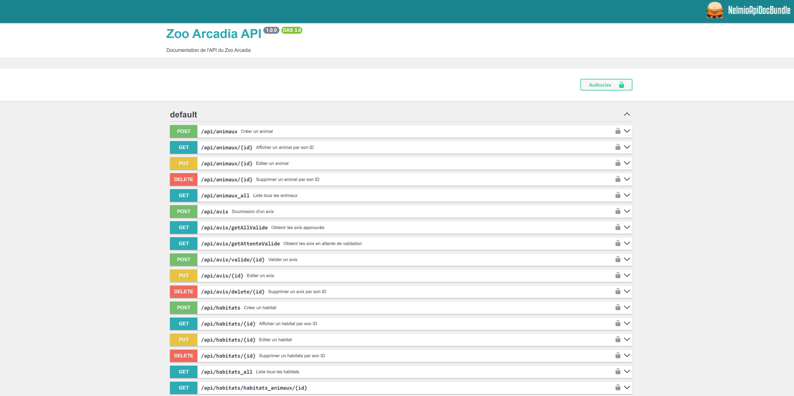

# Zoo Arcadia API

This repository is an evaluation project for STUDI courses written with the last version of Symfony

[](https://github.com/Nomylim)

## Installation instructions
### Project requirements

- [PHP >=8.2.12 or higher]
- [SQL >=8.0.36]
- [Symfony CLI]
- [Composer]
- [Git]
- PHP extensions such as : JSON, Session, Tokenizer and the [usual Symfony application requirements][1].

```bash
$ symfony check:requirements # To check minimal requirements for the project
```
### View



### Installation

1 . **Register a GPG/SSH Key into your Gitlab/Github account** to push verified commits and registry images.

2 . Clone the current repository (SSH):
```bash
$ git clone 'git@github.com:Nomylim/ZooArcadidaBack.git'
```

3 . Move in and create few `.env.{environment}.local` files, according to your environments with your default configuration.
**.local files are not committed to the shared repository.**

```bash
$ cp .env .env.local   # Create .env.$APP_ENV.local files. Complete them with your configuration.
```

> `.env` equals to the last `.env.dist` file before [november 2018][2].

4 . Set your DATABASE_URL in `.env.{environment}.local` files and run these commands :

```bash
$ composer install        # Install all PHP packages
$ php bin/console d:d:c   # Create your DATABASE related to your .env.local configuration
$ php bin/console d:m:m   # Run migrations to setup your DATABASE according to your entities
```

## Usage

```bash
$ symfony server:start    # Use this command to start a local server.
```

## Contributing

Zero contribution is allowed. This software is a final exam. 